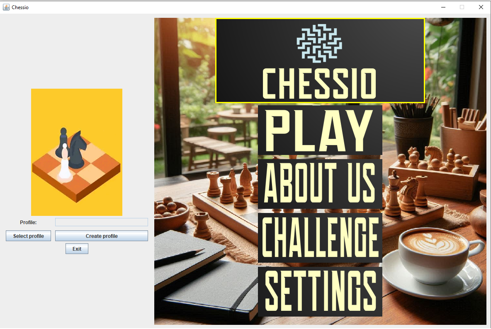
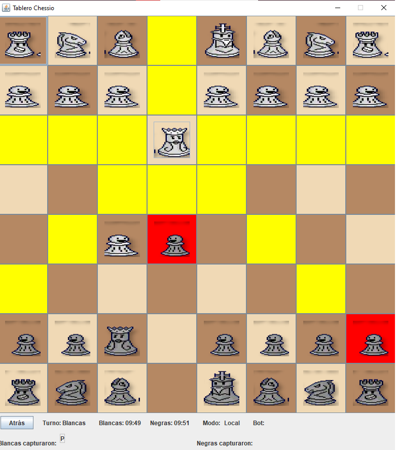

# ♟️ **ChessIO**

Welcome to **ChessIO**, a modern and extensible **Java ♨️ chess project** built for players, learners, and developers alike.
This project delivers **classic chess gameplay**, **analysis tools**, and a set of **advanced AI features** — including a fully configurable **Minimax engine with alpha-beta pruning 🧠**.

---

## 🚀 **Highlights & Key Features**

✨ **Full Chess Rules**

* ✅ Legal move generation, check / checkmate / stalemate detection
* 👑 Castling, ✨ en passant, ♟️ pawn promotion
* 🔁 Draw detection (threefold repetition and fifty-move rule)

🎮 **Player Modes**

* 🧍 Local 2-Player
* 🤖 Human vs AI

🧩 **Minimax-Based Chess Bot**

* 🔍 Adjustable search depth
* ⚡ Alpha-Beta pruning for efficiency
* ⏱️ Iterative deepening for time-based search
* 🧮 Move ordering (captures, promotions, checks prioritized)
* 💾 Transposition table caching
* 🔎 Quiescence search to handle tactical chaos

🧠 **Flexible Evaluation Function**

* ♟️ Material balance and piece-square tables
* 🧭 Mobility (legal moves count)
* 🏰 King safety and basic attack heuristics
* 🧱 Pawn structure analysis (isolated, doubled, passed pawns)
* 🧩 Pluggable custom heuristics for experimentation

💻 **User Interface**

* 🪟 Lightweight **Swing-based GUI** (or console mode)
* ✨ Move highlighting, undo / redo
* 📜 Move list, captured pieces display, and clean board design

---

## 🖼️ **Screenshots / Media**



---

## ⚙️ **Requirements**

* ☕ **Java 11+** (Java 17 recommended)
* 🧰 **Maven** or **Gradle** (optional, for build automation)
* 💡 Optional: an IDE (IntelliJ IDEA, Eclipse, VS Code)

---

## 🏗️ **Quick Start — Build & Run**

### 🧱 Using Maven

```bash
mvn clean package
java -jar target/chessio-1.0-SNAPSHOT.jar
```

### ⚒️ Using Gradle

```bash
./gradlew build
java -jar build/libs/chessio.jar
```

### 💬 Compile & Run Manually

```bash
# compile
javac -d out $(find src -name "*.java")
# run (replace with actual main class)
java -cp out com.dev1d123.chess.Main
```

If you’re unsure which class to run, open `src/` in your IDE and look for:

```java
public static void main(String[] args)
```

---

## 🧠 **How the Bot Works**

The built-in AI is designed for **clarity, configurability, and learning**, rather than brute tournament power.

### Core Components:

* 🌳 **Minimax Search + Alpha-Beta Pruning** — efficient game tree exploration
* 🔁 **Iterative Deepening** — best-move-so-far anytime
* ⚔️ **Move Ordering** — prioritizes captures, checks & promotions
* 🤯 **Quiescence Search** — avoids horizon effect in tactical positions
* 💾 **Transposition Table** — caches previously evaluated positions

---


